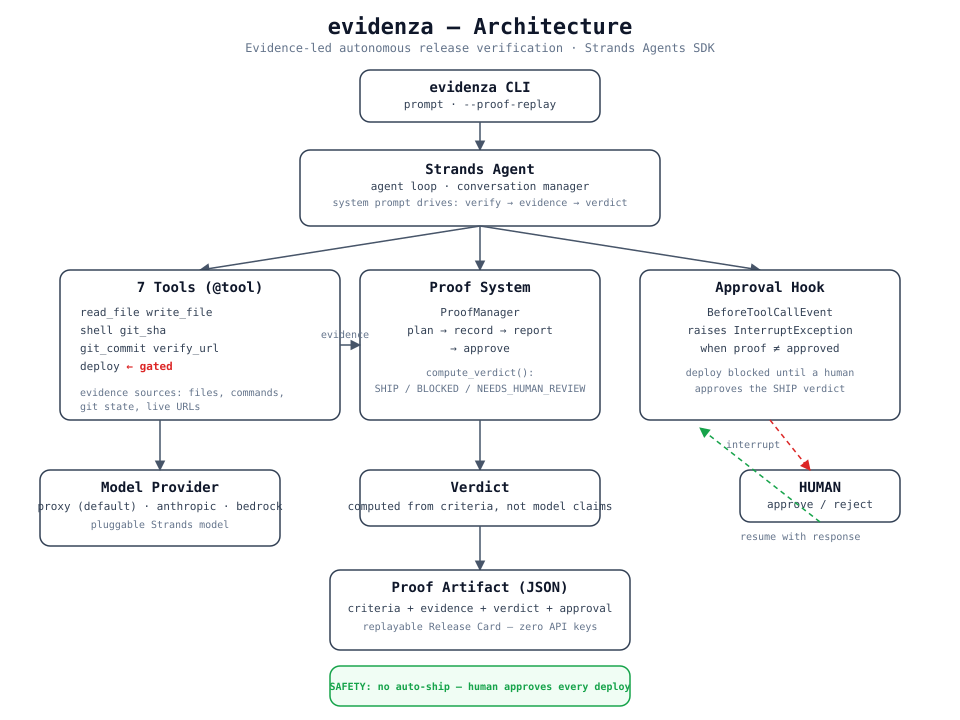

# evidenza

**Evidence-led autonomous release verification agent built on the [Strands Agents SDK](https://strandsagents.com/).**

evidenza gathers concrete verification evidence — git SHA, real test output,
file inspection, live URL checks — and turns it into a **SHIP / BLOCKED /
NEEDS_HUMAN_REVIEW** verdict. It does the routine release-verification work
autonomously, then pauses for a human at exactly one moment: *should we ship?*

Built for the **Agents for Humans** hackathon (AWS × Strands Agents SDK).
Track: **Professional Agents**.

---

## The idea in one sentence

> An agent that won't deploy unless the *evidence* says ship **and** a *human* approves.

Two safety properties make that guarantee real:

1. **Evidence-led verdict** — `SHIP` requires every acceptance criterion to be
   `passed`, computed from recorded evidence, never from the model's assertion.
2. **Human-in-the-loop at impact** — the `deploy` tool is gated by a Strands
   `BeforeToolCallEvent` hook that raises an interrupt. No auto-ship, ever.

---

## 🚀 Quickstart for Judges (zero API keys)

You can evaluate the whole proof system without any model, proxy, or API key —
the evidence *is* the artifact:

```bash
git clone https://github.com/autokeren/evidenza
cd evidenza
pip install -e .

# Replay a pre-recorded, verified proof run
evidenza --proof-replay examples/demo/proof-run.json
```

This renders a visual **Release Card** from a pre-recorded proof artifact:
the criteria, their status, the evidence, the verdict, and the human approval.

For the full interactive demo (which records evidence live), see
[`examples/demo/DEMO.md`](./examples/demo/DEMO.md).

---

## 🎬 Run the full demo

The deterministic demo orchestrates the whole flow with real components — no
flaky model calls, so it records reliably for the demo video:

```bash
python examples/demo/run_demo.py            # SHIP path (all tests pass)
python examples/demo/run_demo.py --block    # BLOCKED path (simulated failure)
```

It walks through: capture git SHA → run the real pytest suite → record each
test as an acceptance criterion → compute the verdict → **attempt deploy without
approval (blocked)** → human approves → deploy proceeds → render the Release Card.

---

## 🏗️ Architecture



The default provider is a **local Anthropic-compatible proxy** (no cloud
credentials needed for dev/demo). Direct Anthropic and Amazon Bedrock are also
supported. See [`ARCHITECTURE.md`](./ARCHITECTURE.md).

---

## 🛠️ Installation

Prerequisites: Python 3.11+.

```bash
git clone https://github.com/autokeren/evidenza
cd evidenza
pip install -e .

# Optional: Amazon Bedrock AgentCore support
pip install -e ".[agentcore]"
```

### Configuration

Copy `config.example.yaml` → `config.yaml` (or use env vars). Default provider
is `proxy`, pointed at a local Anthropic-Messages-compatible proxy:

```yaml
model:
  provider: proxy          # proxy | anthropic | bedrock
  id: claude-sonnet-4-20250514
proxy:
  base_url: http://127.0.0.1:8787   # claude-cf (glm-5.2)
  api_key: dummy
```

Overrides via env: `EVIDENZA_PROVIDER`, `EVIDENZA_MODEL_ID`,
`EVIDENZA_PROXY_URL`, `EVIDENZA_PROXY_KEY`.

---

## 🧪 Testing

```bash
pytest tests/          # 28 tests, deterministic (no network/model needed)
```

---

## 📦 What it does

| Phase | Action | Human? |
|---|---|---|
| **Plan** | Create acceptance criteria for the release | No |
| **Record** | Capture git SHA + run tests + read files as evidence | No |
| **Verdict** | Compute SHIP / BLOCKED / NEEDS_HUMAN_REVIEW from evidence | No |
| **Approval** | If SHIP, `deploy` raises an interrupt → human must approve | ✅ **Yes** |
| **Publish** | Only after approval, deploy proceeds | No |
| **Replay** | Proof JSON renders a Release Card, zero API keys | — |

---

## 🎯 Agents for Humans Hackathon

- **Track:** Professional Agents
- **Build period:** August 10 – September 14, 2026
- **Demo video:** [YouTube link TBD]
- **Architecture:** Strands Agents SDK orchestrator + 7 lean tools + a
  human-in-the-loop approval hook + a replayable proof system.

---

## Acknowledgments & Prior Work

This project, **evidenza**, is a fresh implementation built during the
Agents for Humans hackathon (Aug 10 – Sep 14, 2026). The release verification
concept (evidence-led SHIP/BLOCKED/NEEDS_HUMAN_REVIEW verdict system,
safe-deploy workflow) builds upon ideas explored in the author's prior
open-source project, [autokeren](https://github.com/autokeren/autokeren)
(MIT license).

evidenza is a new, lean codebase written from scratch during the submission
period, using the Strands Agents SDK as the agent orchestrator. No code was
directly copied from autokeren; the concepts were reimplemented in a minimal
form tailored to demonstrate the release-verification agent pattern with
Strands. The author is the original creator of autokeren and owns its
copyright.

---

## 📄 License

MIT — see [LICENSE](./LICENSE).